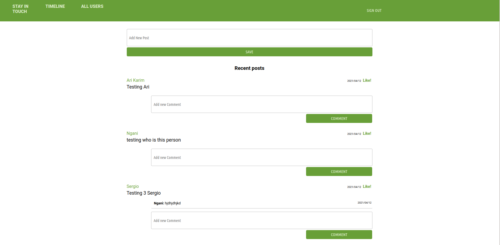

# Private-Events

## Table of Contents
  <br />

* [About the Project](#about-the-project)
* [Built With](#built-with)
* [Contributing](#contributing)
* [Contact](#authors)
* [Acknowledgements](#acknowledgements) 

#
<br />

[](https://forthebadge.com) </br>


<br />

#


<!-- ABOUT THE PROJECT   -->
## About The Project

The Private Event project sets up an initial rails app containing a User, Event databases. This page can log in users and create events for each of them. As well can let users attend others events.

## Screenshot Test
#
<p align="center">
  
</p>

## Contributing

Contributions make the open-source community such an amazing place to learn, inspire, and create. Any contributions you make are **greatly appreciated**.

## Prequisites

Ruby & Rails installed on your local machine.
bundle installed on your machine
Terminal or similar to execute the program.


## Getting Started


## Clone project

- To get a local copy up and running follow these simple example steps.
- Clone this repository with git clone ```https://github.com/sergiocortessat/Rails_Private_Events/tree/feature``` using your terminal or command line.
- Change to the project directory by entering: ```cd Private_Events``` in the terminal.


## How to use the Private-Event app
1. run the command ```bundle install```   This will install the required dependencies
2. run the command ```rails webpacker:install ``` This will install the webpack to avoid specific rails 6 problems
3. run the command ```rails db:create``` This will initialize the necessary migration files
4. run the command ```rails db:migrate``` 
5. run the command ```rails server```


## Testing

In this project, the testing was done using Rspec and Capybara to test logic and forms


## Run
The testing file is included in spec folder under logicrspec.rb.
- go to the folder spec: cd spec
- Inside your terminal type you can type: 

1. Rspec features/create_event_spec.rb
2. Rspec features/attended_event_spec.rb
3. Rspec features/event_spec.rb
4. Rspec features/user_spec.rb
5. Rspec models/event_spec.rb
6. Rspec models/user_spec.rb
7. Rspec system/sign_up_spec.rb
8. Rspec system/user_sing_in_spec.rb

- All test pass

## Authors

👤 Sergio Cortes Satizabal

- Github: [@sergiocortessat](https://github.com/sergiocortessat)
- Twitter: [@sergiocortessat](https://twitter.com/sergiocortessat)
- LinkedIn: [@sergiocortessat](www.linkedin.com/in/sergio-cortes-satizabal-3b452194)

👤 

- Github: [@nganifaith](https://github.com/nganifaith)
- Twitter: [@nganifaith](https://twitter.com/Bright_Ngani)
- LinkedIn: [@nganifaith](https://www.linkedin.com/in/ngani-faith/)


Project Link: [Rails-Private-Events](https://github.com/sergiocortessat/Rails_Private_Events/issues/2)


### Built With

* [RUBY]
* [RAILS]
* [DEVISE]
* [RSPEC&CAPIBARA]

<!-- ACKNOWLEDGEMENTS -->
## Acknowledgements

* [Microverse](https://www.microverse.org/)

## 📝 License

This project is [MIT](https://github.com/sergiocortessat/sergiocortessat/blob/main/LICENSE) licensed.


